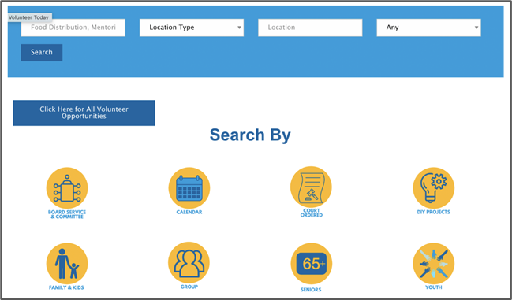

# Voluntree

## Table of contents

* [Overview](#overview)
* [User Guide](#user-guide)
* [Developer Guide](#developer-guide)
* [Team](#team)

## Overview

Many volunteers often want to help more in their communities but can’t find opportunities or never hear back after applying. Our web application, Voluntree, is designed to facilitate and streamline the process of finding and engaging in volunteer opportunities. Our goal is to empower individuals to impact their communities by enhancing the volunteer experience.

## User Guide

This section provides a walkthrough of the Voluntree user interface and its capabilities.

### Landing Page

The landing page is presented to users when they visit the top-level URL to the site.




## Developer Guide

This section provides information of interest to Meteor developers wishing to use this code base as a basis for their own development tasks.

### Installation

First, [install Meteor](https://www.meteor.com/install).

Second, visit the [Voluntree application github page](https://github.com/team-four-ics414/voluntree), and click the "Use this template" button to create your own repository initialized with a copy of this application. Alternatively, you can download the sources as a zip file or make a fork of the repo.  However you do it, download a copy of the repo to your local computer.

Third, cd into the voluntree/app directory and install libraries with:

```
$ meteor npm install
```

Fourth, run the system with:

```
$ meteor npm run start
```

If all goes well, the application will appear at [http://localhost:3000](http://localhost:3000).

### Quality Assurance

#### ESLint

Voluntree includes a .eslintrc file to define the coding style adhered to in this application. You can invoke ESLint from the command line as follows:

```
meteor npm run lint
```

ESLint should run without generating any errors.

It's significantly easier to do development with ESLint integrated directly into your IDE (such as IntelliJ).

<!-- To run the testcafe tests in continuous integration mode, first ensure that BowFolios is not running in any console.

Then, invoke `meteor npm run testcafe-ci`.  You will not see any windows appear.  When the tests finish, the console should look like this: -->

<!-- ## Continuous Integration -->

<!--  -->
<!-- 
BowFolios uses [GitHub Actions](https://docs.github.com/en/free-pro-team@latest/actions) to automatically run ESLint and TestCafe each time a commit is made to the default branch.  You can see the results of all recent "workflows" at [https://github.com/bowfolios/bowfolios/actions](https://github.com/bowfolios/bowfolios/actions).

The workflow definition file is quite simple and is located at
[.github/workflows/ci.yml](https://github.com/bowfolios/bowfolios/blob/main/.github/workflows/ci.yml).

## Development History

The development process for BowFolios conformed to [Issue Driven Project Management](http://courses.ics.hawaii.edu/ics314f19/modules/project-management/) practices. In a nutshell:

* Development consists of a sequence of Milestones.
* Each Milestone is specified as a set of tasks.
* Each task is described using a GitHub Issue, and is assigned to a single developer to complete.
* Tasks should typically consist of work that can be completed in 2-4 days.
* The work for each task is accomplished with a git branch named "issue-XX", where XX is replaced by the issue number.
* When a task is complete, its corresponding issue is closed and its corresponding git branch is merged into master.
* The state (todo, in progress, complete) of each task for a milestone is managed using a GitHub Project Board.

The following sections document the development history of BowFolios. -->

### Milestone 1: Mockup development

The goal of Milestone 1 was to create a set of HTML pages providing a mockup of the pages in the system.

Milestone 1 was managed using [Voluntree GitHub Project Board M1](github.com/orgs/team-four-ics414/projects/1/views/1):

<!--  -->


## Team
<a href="https://docs.google.com/document/d/1HzVU5eNaOKwZTcOlpzt41Stc-MVNvmtfGm1l0Z7hIWY/edit#heading=h.tr1mqkwqj2nv">Team Contract</a>

<div style="display: grid; grid-template-columns: 1fr 3fr; grid-gap: 40px;">

<div>


</div>

<div>

<h3 style="text-align:center;">Michael Nakagawa</h3>

<div style="background-color:#F4F7F9; border-left: 2px solid cornflowerblue; padding: 1px 10px;">

<p>Tell something about yourself</p>

</div>

</div>

<div>


</div>

<div>

<h3 style="text-align:center;"><a href="https://silviadebenedictis.github.io/">Silvia De Benedictis</a></h3>

<div style="background-color:#F4F7F9; border-left: 2px solid cornflowerblue; padding: 1px 10px;">

<p>Silvia is a Computer Science student expecting to graduate in Spring 2024. Her interests are in Programming, Web Design, and Graphic Design.</p>

</div>

</div>

<div>


</div>

<div>

<h3 style="text-align:center;">Sean Dunston</h3>

<div style="background-color:#F4F7F9; border-left: 2px solid cornflowerblue; padding: 1px 10px;">

<p>Tell something about yourself</p>

</div>

</div>

<div>


</div>

<div>

<h3 style="text-align:center;"><a href="gavyngostage.github.io">Gavyn Gostage</a></h3>

<div style="background-color:#F4F7F9; border-left: 2px solid cornflowerblue; padding: 1px 10px;">

<p>Gavyn is studying for his Undergrad in Information and Computer Sciences. He is set to graduate FALL 2024</p>

</div>

</div>

<div>


</div>

<div>

<h3 style="text-align:center;"><a href="https://mikhail-shkaralevich.github.io/">Mikhail Shkaralevich</a></h3>

<div style="background-color:#F4F7F9; border-left: 2px solid cornflowerblue; padding: 1px 10px;">

<p>I am studying for a B.S. in Computer Science in the Department of Information and Computer Sciences at the University of Hawaii. I expect to graduate in Spring, 2025.</p>

<p>Interests: Software Engineering, Cybersecurity, Robotics, Web Development</p>

<p>I am excited to work on the project in the team based environment. I would love to develop efficient communication skills.</p>

</div>

</div>

<div>


</div>

<div>

<h3 style="text-align:center;"><a href="https://joelvanta.github.io/">Joel Vanta</a></h3>

<div style="background-color:#F4F7F9; border-left: 2px solid cornflowerblue; padding: 1px 10px;">

<p>Joel is a senior Computer Science with a concentration in Security Science student at the University of Hawaii at Manoa and expecting to graduate in Spring 2024.</p>

<p>Interests: Cybersecurity, Artificial Intelligence, Machine Learning</p>

</div>

</div>

<div>


</div>

<div>

<h3 style="text-align:center;"><a href="https://kamanelelehua.github.io/">Victoria Ka'aihili</h3>

<div style="background-color:#F4F7F9; border-left: 2px solid cornflowerblue; padding: 1px 10px;">

<p>Victoria is a senior Computer Engineering student at the University of Hawaii at Manoa and expecting to graduate in Summer 2024.</p>

<p>Interests: Software Engineering, Web Development, App Development</p>

</div>

</div>

- more members should be added here, follow the same pattern...

</div>
